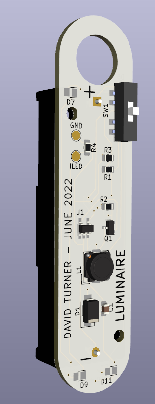

# Luminaire

A small light intended to hang in my tent for camping.  Powered by a single AA
battery (lifetime should be 10-20 hours depending on battery capacity and
brightness setting).  Uses the handy ZXSC310 from Diodes Inc as a step-up
(boost) converter.

